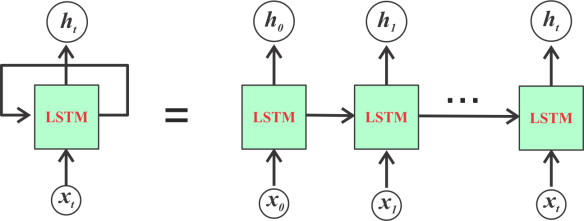

# Stock Price Prediction using LSTM :hand: sp20

| Rishabh Agrawal
| ragrawa@iu.edu
| Intelligent Systems Engineering, Indiana University

---

Keywords: Cloud, Machine Learning, Graphs, Stock Market, Predictions, LSTM

---

## Abstract

I have been wanting to do stock price predictions for a long time. 
Predicting the prices can help you invest and remove your money 
at the right time. I decided to do this project alone. I used
LSTM (Long Short-Term Memory) which is turns out to be 
perfect for predicting stocks. I will explain more about this
in the Introduction. 

## Introduction

Predictions made using machine learning is the future.
The faster someone understands this, the faster people
understand this, the better they will be able to adjust
to it and work around it. Machine learning is going to 
take over, no matter how much someone tried to stop it.
It is just way too effecient.

Machine learning is already taking over industries we 
can't even think of. Companies like McDonalds and KFC 
are using AI instead of people to reduce costs.

Machine learning really fascinates me, as well as buying
and selling stocks. So this project was a perfect 
compilation for both. I used LSTM will the open source 
data available online of daily stock prices to build 
this Stock Price Predictor.

## Background
I think stock predictions is going to be really helpful in
the near future, when even more precise predictions could
be made using a much stronger model.

For training the model I needed a lot of data to train the model.
I chose to take the Yahoo Finance to get the stock prices
because it is really realiable and has been since a really
long time so I can get old and new data with high reliabilty.
Stock prices are available on other websites as well, and it
wouldn't change much. However, my code will only work for a 
Yahoo Finance dataset.

I used closing prices to predict the prices. If I would have
used the open price, I dont think it would have made a huge
difference. 

## Methods

I started out really naive and tried using Linear Regression 
to train and predict the prices, and as you'd expect, the model 
was really bad. Infact, I just got a straight line of best fit 
it seemed like. However, I started searching about more things 
and I found LSTM which is really good for stock predictions 
specifically because the price of the stock in the next moment 
doesn't really depend on the entire past stock pattern, rather 
is determined by the the last few values. Maybe the last 10 days, 
or 20 days. I read a great analogy of LSTM 
[here](https://colah.github.io/posts/2015-08-Understanding-LSTMs/). 
It said, when you watch a movie, and want to classify what kind of 
event is happening in the movie right now, you would base it upon the 
last 5-10 minutes of the movie rather than the entire movie as a whole. 

Stock prices do work like this. There is a term in during which the 
prices are steady, or up, or down and there are numerous reasons to 
that. New CEO assigned. New product lauched. New direction taken by 
the company. Merger with or acquiring a company. Market crash. Or 
even a GLOBAL PANDEMIC 

{#fig:LSTM}

This image explains LSTM well. Basically, I output can be considered
as a sum of the past few outputs. It is similar to nuerons in a nueral 
net but slightly more complicated than that. It takes in account
the last few outputs.

## Implementation

I used OAS3 with Flask. OAS3 handles the endpoints for me. The 
endpoints include /upload_data, /train, /predict, /split(data)
as well as some plotting endpoints. This helped me handle the user
side and what requests they send.

Flask acts like a bridge between my Python3 backend and the front-end.
Connexxion handles the entire UI for this and sends the output accordingly.

## Conclusion
I think I learnt a lot from this project. I have worked with Flask before,
but just to make some websites to attach with my Python backend. But this
was a new and a more professional way. I also learning about APIs and 
how to use connexion to make our lives easier. 

Moreover, I think I also learnt about markdowns, containersi (Docker) and
got a more clear understanding about Makefiles. This project seemed like
a real life project, one we might get during an internship and I think doing
this just makes me more comfortable with it. 
